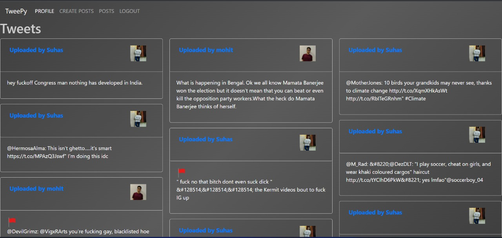
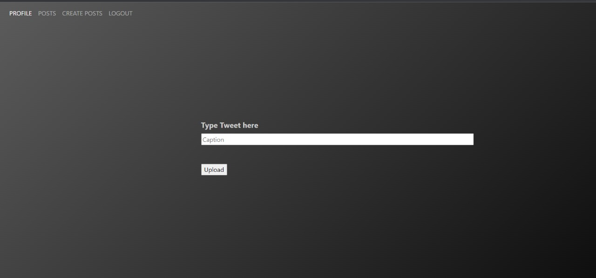

# Offensive Tweet Flagger

## Description
A twitter like socila media application with an integrated offensive tweet flagger. Apart from the regular offensive tweets which are in english, this tweet flagger also accounts for Hinglish(Hindi words written in english) words and is therefore more suited for tweets based from India

## How to run the code?
To run the program, execute the following commands
1. `pip install -r requirements.txt`
2. `python app.py`

## Output

- Login Page

- Dasboard

- Create Tweet Page

